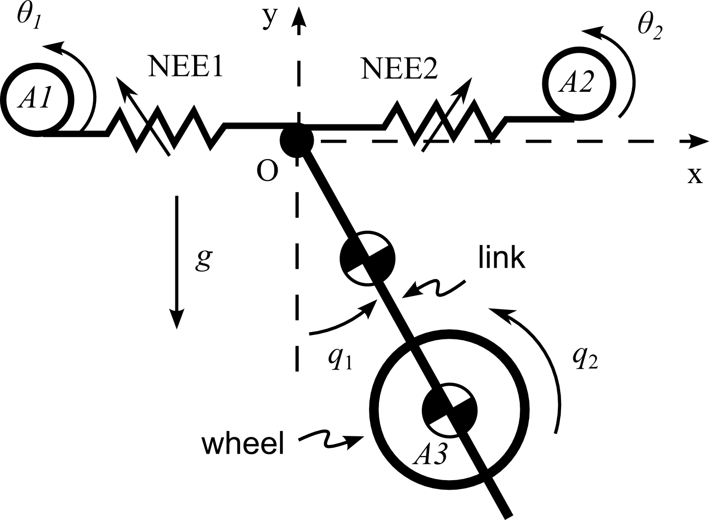
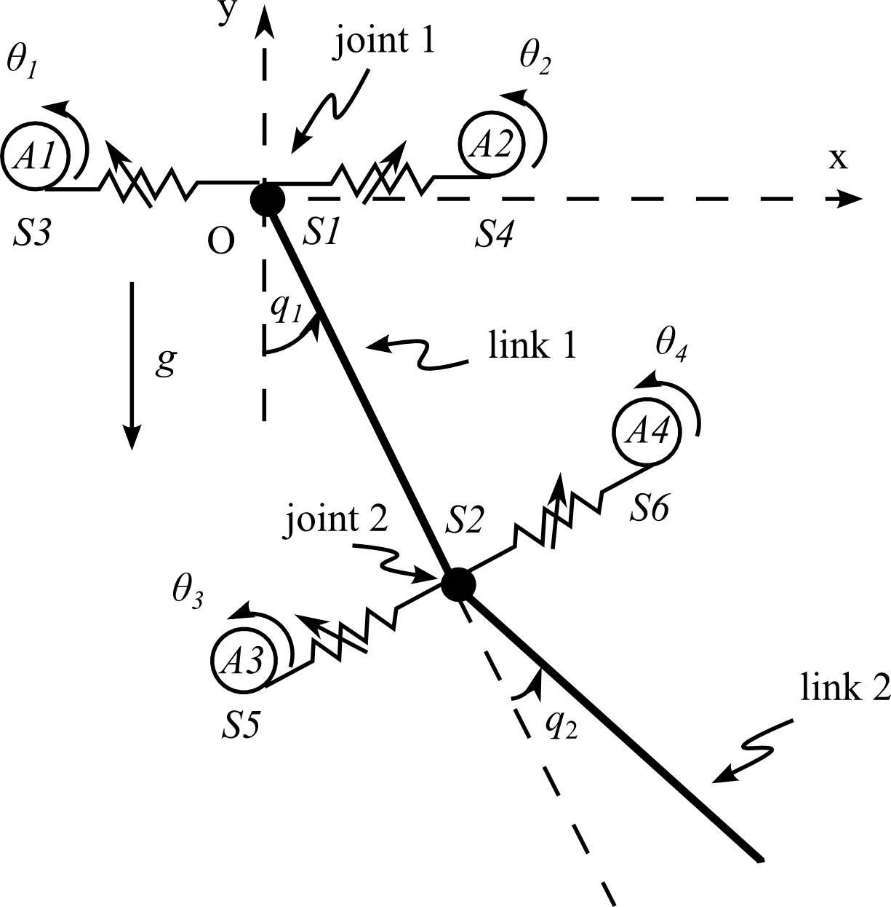
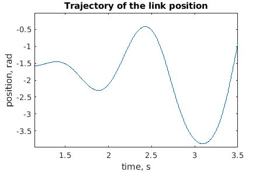

<link rel="stylesheet" href="/observability_measure.github.io/default.css">

# Tutorial on Observability Measure
In this tutorial the observability measure based optimal sensor placement is considered. This tutorial provides detailed disuccsion of the following steps of sensor placement problem:
1. Problem Statement
2. Key concepts
3. Systems
3. Observability Rank Condition for Nonlinear Systems
4. Observability Gramian
5. Implementation

The [MATLAB](https://www.mathworks.com/products/matlab.html) implementation of the tutorial can be downloaded from the above link. The tutorial shows the implementation of the Optimal Sensor Placement discussed in the paper (link to the paper). In this tutorial two different systems are considered:
  1. VSA robot with reaction wheel
  2. Double linked VSA robot
  
Examples of this page shows only VSA robot with reaction wheel. However, you can find for second example download flies with well documented code.

## Citation
If you use our code we kindly ask to cite the following paper:
<table>

<tr valign="top">
<td align="right" class="bibtexnumber">
[<a name="8700432">1</a>]
</td>
<td class="bibtexitem">
A.&nbsp;Zhakatayev, B.&nbsp;Rakhim, O.&nbsp;Adiyatov, and H.&nbsp;A. Varol,
  &ldquo;Optimal Sensor Placement of Variable Impedance Actuated Robots,&rdquo; in <em>2019 IEEE/SICE International Symposium on System Integration (SII)</em>,Jan,2019, pp. 141-146.
[&nbsp;<a href="/observability_measure.github.io/citation.bib">bib</a>&nbsp;| 
<a href="https://ieeexplore.ieee.org/abstract/document/8700432">PDF</a>&nbsp;]
</td>
</tr>
</table>

[//]: <>(1. What is sensor placement problem and observability measure. Key concepts.)
[//]: <>(2. How Observability is measured)
[//]: <>(3. How the sensor placement problem is solved)

## Optimal Sensor Placement problem 
The following system dynamics is considered:
\begin{align}
\dot{x} &= f(x,u) \newline
y&=h(x,u)=Cx+Du
\end{align}
`x` - states of the system

`u` - input

`y` - output

The following problem is the notation for Optimal Sensor placement:
    \begin{align}
            & \min_{s_1,s_2,\dots,s_p} J(y)\newline
            \text{subject to:} \newline
            & \dot{x} = f(x,u) \newline
            y &= [s_1h_1(x), s_2h_2(x), \dots, s_p h_p(x)]^T \newline
            s_i &\in \{0,1\}, ~ i=1,\dots,p
    \end{align}
This is [Mixed Integer Problem](http://www.optimization-online.org/DB_FILE/2009/06/2329.pdf). The cost function is $J(y) = log(det(W^{-1}))$ chosen as it is described in the paper. The solution of this problem provides the vector `s` that represents which sensor configuration that is optimal. 

## Key concepts
**1.** Oprimal Sensor Placement: The problem, where sensor configuration, position, orientation is selected by optimization of some cost function that represents desired specification subject to additional constraints. This tutorial contains only configuration selection from available separate sensors. 

**2.** Observability Measure: Information about Observability for linear systems can be found here [here](https://en.wikipedia.org/wiki/Observability). The main idea of *observability* is if it is possible to restore the states of the system `x` from the sensor readings `y` and inputs `u` given some configuration of sensors `s`. The observability Measure provides the information on how changes in sensor-space maps to changes on state-space, or simplified, how $\Delta y$ is related to $\Delta x$.

**3.** [Observability Gramian](https://en.wikipedia.org/wiki/Observability_Gramian): [Symmetric Positive Definite Matrix](https://en.wikipedia.org/wiki/Positive-definite_matrix) that can be utilized for observability measure.

## Systems
**1.** Variable Stiffness Actuator Robot with Reaction Wheel

**2.** Double-linked VSA robot

## Observability Rank Condition for Nonlinear Systems 

In linear systems, the observability rank condition provides genral information about system. However, for nonlinear systems, observability could change on states. Therefore, observability is slightly different for Nonlinear systems. The following code shows how to check observability for nonlinear systems in MATLAB using symbolic toolbox as it was described in paper:
<pre>
<code class="matlab">
U= sym('U',[3,7]); %input-space
x =sym('x',[7,1]); %state-space

load('data.mat'); % loads the data about the VSA robot.  

dy = <a href="https://github.com/ARMSLab/observability_measure.github.io/blob/master/Observability/VSAwrw/nonlin_eq_VSA.m">nonlin_eq_VSA</a>(x,U(:,1), sys) ; %nonlinear dynamics of the system    

% create matrix of ouputs so that y=C*x
C=zeros(4,7);                       
C(1,1)=1;
C(2,3)=1;
C(3,4)=1;
C(4,5)=1;
C=sym(C);

Y=sym(zeros(7,4));            %sensor-space y=[s1,...,s4; dot_s1,...,s4;...]
for ind=1:4
    Y(:,ind) = C(ind,:)*x;
end

% find time derivatives of each sensors independently to fill the Y.
%Seven's order derivative is sufficient.
for ind1=1:4
    for ind2=2:7
        Y(ind2,ind1) = <a href="https://github.com/ARMSLab/observability_measure.github.io/blob/master/Observability/VSAwrw/lder.m">lder</a>(Y(ind2-1,ind1),dy,x);
        for ind3=1:ind2
            Y(ind2,ind1) =  Y(ind2,ind1) + <a href="https://github.com/ARMSLab/observability_measure.github.io/blob/master/Observability/VSAwrw/lder.m">lder</a>(Y(ind2-1,ind1),U(:,ind2),U(:,ind2-1));
        end
    end
end

% 
K=sym(zeros(7,7,4)); 
for ind1=1:4
    K(:,:,ind1) = jacobian(Y(:,ind1),x);  %for each sensors create the observability matrix
end

%%
%to find observability of combination of sensor 1 and 2:
rank([K(:,:,1); K(:,:,2)])
</code>
</pre>

## Observability Gramian
Observability Gramian for nonlinear system is slightly different fron linear one. In nonlinear system, the observability changes with the states. Also, system could use only specific region where it is observable and controllable. It is impossible to check observability for each state of the operation region. That is why trajectory is generated along which observability gramian is calculated. For VSA system trajectroy looks like following:

Observability Gramian  can be calculated using two different ways: Empirical and Linearized. 
In linearized case, Gramian for nonlinear system calculated as linear one by linearization of the system and feeding the linearized matrix as following:

\begin{align}
        W(t) = \int^{t}_{0}\Phi^T_dC^TC\Phi(t) dt \newline
        \dot{\Phi}(t) = A(x(t),u(t))\Phi(t) \newline
        A(x(t),u(t)) = \frac{\partial f(x,u)}{\partial x} \newline
        \Phi(0) = I
\end{align}

Here the matrix $\Phi$ represents the transition of the 
Implementation of this method can be found in tutorial. 
In empirical Gramian method, the Gramian is calculated by perturbing the states and calculation of the outputs:
\begin{align}
\bar{x}^{\pm k}_0 = x_0 \pm \epsilon e_k  \newline
y^{\pm i} & = h(\bar{x}^{\pm i}(t)) \newline
W(i,j) &= \frac{1}{4\epsilon^2}\int^{T}_0 (y^{+i} - y^{-i})^T(y^{+j} - y^{-j})dt
\end{align}

$\epsilon$ - perturbation scalar, in majority of cases 0.001 is sufficient number.

$e_k $ - $k$'s unit vector, i.e. $e_2 \in \mathbb{R}^4 = [0 ,1 ,0 ,0]^T$.

Emperical gramian provides same results as Linarized Gramian, but it is is computationally faster. 

## Implementation of Optimal Sensor Placement

This code provides implementation of the observability Gramian based sensor minimization problem solution:

<pre>
<code class="matlab">
load('data.mat'); % loads the data of simulation
C = eye(7,7);     % y=C*x
t = Ts/10;        % sampling time of emprircal gramian compared to sampling time of trajectory
epsi=0.001;       % perturbation of empirical gramian
model =@(x,u)<a href="https://github.com/ARMSLab/observability_measure.github.io/blob/master/Observability/VSAwrw/nonlin_eq_VSA.m">lnonlin_eq_VSA</a>(x,u,sys);   %nonlinear dynamics of the system
W_emp=zeros(7,7,7);                    %initialization to store all sensor's empirical gramian 
for i=1:7
     W_emp(:,:,i) =<a href="https://github.com/ARMSLab/observability_measure.github.io/blob/master/Observability/VSAwrw/observGramEmp.m">observGramEmp</a>(C(i,:),t,Ts,y,epsi,un',model); %<a href="https://github.com/ARMSLab/observability_measure.github.io/blob/master/Observability/VSAwrw/observGramLin.m">observGramLin</a>(C(i,:),Ts,y,un',sys);%
end
k=<a href="https://github.com/ARMSLab/observability_measure.github.io/blob/master/Observability/VSAwrw/valid_sensor_conf.m">valid_sensor_conf</a>([1,3,4,5],4); % the all sensor configurations that should be checked
m = 1e90;                         % maximal number
ind=1;                            %initialization for index
obm = zeros(length(k),1);         % vector to store the observabilities of all valid sensor configurations

%optimization to find minimal cost function over valid sensor configurations
for j=1:length(k)
    W=zeros(7,7);
    C=zeros(length(k{j}),7);
    for i=1:length(k{j})
        C(i,k{j}(i))=1;
    end
    for i=1:length(k{j})
        W=W+W_emp(:,:,k{j}(i));%W=W+observGramEmp(C(i,:),t,Ts,y,epsi,un',model);
    end
    obm(j)=log(det(W^(-1)));
    if(obm(j)<m)
        m = obm(j);
        ind=j;
    end
end

k{ind}  %the sensor optimal configuration
m       % the value of cost function

s=zeros(7,1);              %representation of the solution as in problem statement
for ind2=1:length(k{ind})
    s(k{ind}(ind2))=1;
end

s
</code>
</pre>

Result of this code: 
<pre>
<code class="matlab">
ans =

     1     3     4     5

m =

   30.6300

s =

     1
     0
     1
     1
     1
     0
     0
</code>
</pre>
